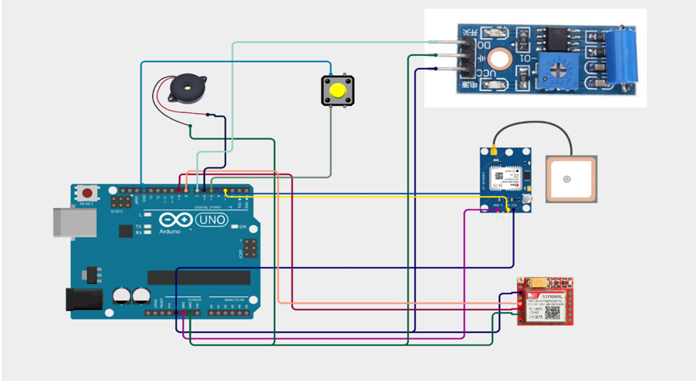
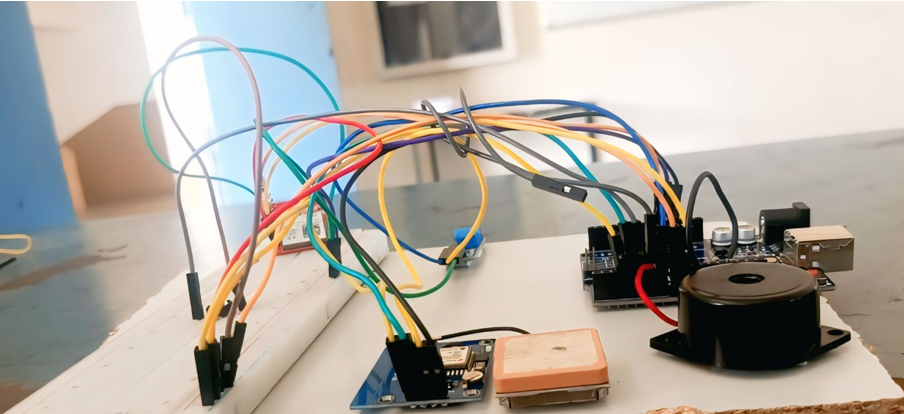

# Accident-Alert-and-Location-Tracking-System

## 📌 Overview
Road accidents often result in severe injuries due to delays in emergency response.  
This project presents an **Accident Alert and Location Tracking System** that uses:
- **GPS Module** to fetch real-time location (latitude & longitude).
- **GSM Module** to send SMS and make emergency calls.
- **Vibration Sensor** to detect accidents.

When an accident is detected, the system:
1. Triggers a local buzzer alert.
2. Fetches GPS coordinates.
3. Sends SMS alerts with Google Maps link.
4. Makes automatic phone calls to **ambulance**, **hospital**, and **family members**.

This ensures quick medical assistance and reduces delays that may cost lives.

---

## ⚙️ Features
- ✅ Real-time **GPS location tracking**
- ✅ **Automatic SMS alert** with Google Maps link
- ✅ **Emergency call feature**
- ✅ **Customizable contacts** (family, hospital, ambulance)
- ✅ **Buzzer alert** for nearby awareness
- ✅ **Reset button** to cancel false alarms
- ✅ Low-cost and Arduino-compatible

---

## 🛠️ Components Required
- Arduino Uno / Nano  
- GPS Module (Neo-6M)  
- GSM Module (SIM800L)  
- Vibration Sensor (SW-420)  
- Buzzer  
- Push Button (for reset)  
- Power Supply (9V–12V Battery/Adapter)  

---

## 🖼️ System Architecture
- **Accident Detection:** Vibration sensor detects collision.  
- **Location Tracking:** GPS fetches coordinates.  
- **Alert System:** GSM sends SMS & makes calls.  
- **Control Unit:** Arduino processes and coordinates actions.  

  
  

---

## 💻 Code
The system is implemented in Arduino C/C++.

Key functions:
- `getGPSLocation()` → Reads latitude & longitude.  
- `sendSMS()` → Sends accident alert SMS with Google Maps link.  
- `makeEmergencyCall()` → Calls ambulance number for 20 seconds.  
- `notifyAll()` → Sends messages to ambulance, hospital, and family.  

Code file: [`code.c`](code.c.txt)

---

## 📊 Results
- SMS alert sent with location coordinates & Google Maps link.  
- Automatic emergency calls placed.  
- System tested successfully in prototype conditions.  
